# GARUDA

GARUDA is an open-Source platform where viewing of listed assets to
auditing of assets happens. GARUDA has a secure interface to
communicate with Blockchain.​ **GARUDA has mainly three main types of
roles for it’s users, namely;**
**1) Administration
**2) Government  
**3) Users**  
The most Important part of GARUDA is building lightweight Blockchain
clients and customize blockchain explorers for users to navigate and view
data on Blockchain with ease. GARUDA is a marketplace for various kinds
of real estate assets which have these categories such as of residential,
commercial, agriculture etc. For every user, GARUDA provides data based
insights for every asset. So that therefore a user can make a well informed
decision.  
**To have a more detailed understanding of Garuda let’s look at how it
actually works,**  
The USERS will have access to Web/Smartphone Interface powered by
Blockchain through which ​ **Investors** ​ can view ​ **Assets, Revenues, and
Expenses.**   

## USE
With GARUDA you can track the real usage of your Assets as well as get
real time reports. You can control your usage by QR codes Smartlock
powered by Blockchain Technology. You can push the usage of your
Assets to market place in order to generate more profitable revenue.


## RENT

Rent out your fractional ownership or lifetime usage with GARUDA. You
can use it’s features such as marketplace to get or find the best offers
which also enables users to find the best rents. There will be an automated
check in and check out using Smartlock QR codes for the best of your
safety and convenience. You will get access to important verticals such as
reports, revenues, return of investment etc. to give you the best experience
from the renting services of GARUDA.
## INVEST
Users can invest in fractional or lifetime usage ownership using GARUDA.
You can check ownerships and assessment while investing and get access
to property or asset reports, estimated revenues and dividends. And the
most important part here is you can check your investment reports.
## TRADE
Trade assets will be based on cryptocurrencies. You can easily transfer
your assets or real estates. With trade, push your assets to the
marketplace to receive best deals as well as check marketplaces to find
best deals with GARUDA. In trading as well you will have access to trade
and revenues and revenues. With this we also give users the service of
requesting transfer of assets.
## MANAGE/OPERATE
You can manage your real estates or assets with much ease. Users can
easily record expenses and revenues. They can organise audit meetings
and publish in order to share the audit with the community.


## ACTIVITIES OF GARUDA

→ Startups
→ Investors
→ Families
will have access to

1. Use
2. Rent
3. Trade
4. Invest
Fractional Ownership and Lifetime Usage Rights.
→ Farmers
→ Professionals
→ Individuals
will have access to
1. Manage/Operate
Real Estates, Assets and Entities.


         
For More Understanding look into below Image:-  
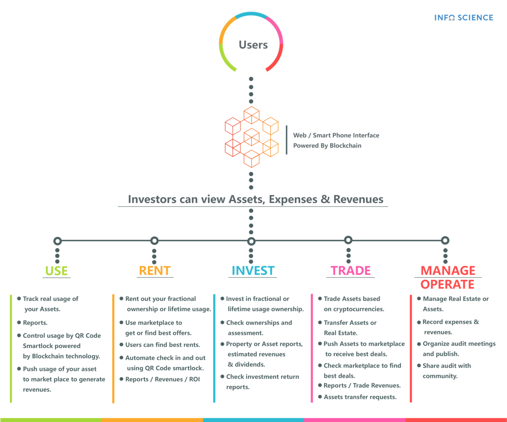
       
## Activities
 Before Starting with Garuda lets looks on There Activities:-  
 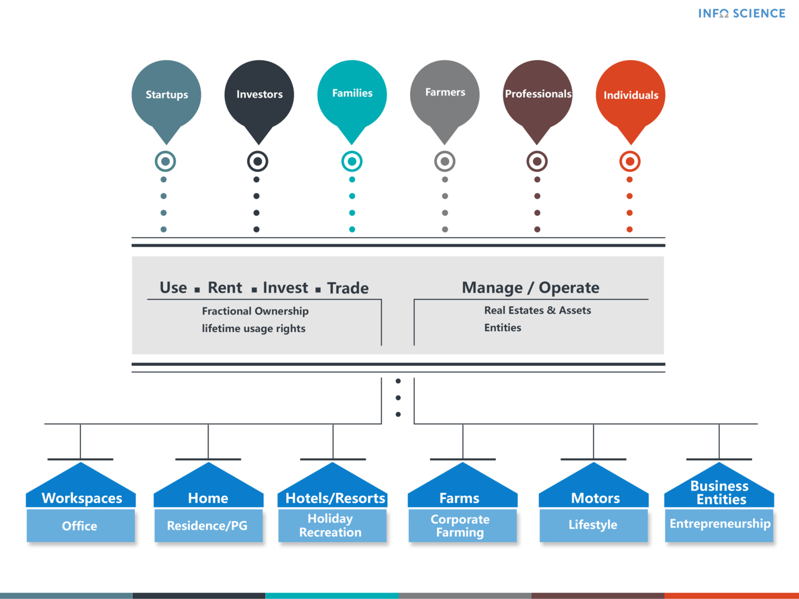
       
## Getting Started

There are following 4 parts of garuda:-
* Garuda-API [click to clone](https://github.com/Infosciencelabsdev/Garuda-API)
* Garuda-Processor [click to clone](https://github.com/Infosciencelabsdev/Garuda-Processor)
* Garuda-Angular [click to clone](https://github.com/Infosciencelabsdev/Garuda-Angular)
* Garuda-Explorer [click to clone](https://github.com/Infosciencelabsdev/Garuda-Explorer)  
Below Image helps you to understand Technical Structure of Project:-  
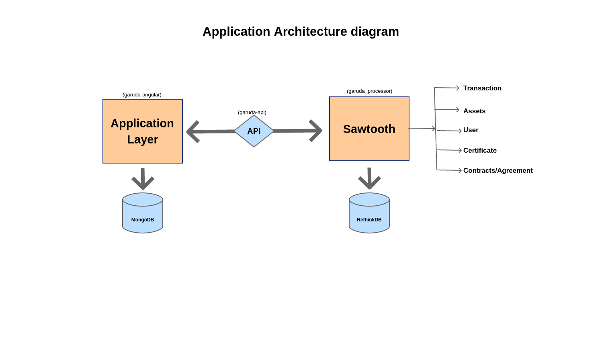
```
After cloning all above parts of Garuda, you have to Look on Prerequisites and Installing
```
### Prerequisites

This is the tech Stack we are using to develop Garuda. Make sure you are familiar with all of these:-
1. NodeJs - Server Side
2. Hapi Framework - Creating routes using Server
3. TypeScript - Language used for Node and Angular
4. MySql - Database
5. Sawtooth Javascript SDK - To store data over Blockchain
6. Docker - Making microservices using containers.
7. Angular 6/7/8 - Front End Portion


### Installing

To reproduce the Garuda Environment in your local system you can refer to this:

#### Setting up RethinkDB:
* Install RethinkDB. 
* Run RethinkDB as a service by running it at startup:[Start_RethinkDB](https://rethinkdb.com/docs/start-on-startup/)
 You can access RerthinkDB at localhost:8080.
* You can create databases and tables under 'TABLES' and access the data under "DATA EXPLORER",Create a database: "explorer" and create 2 tables under this: "PropData" [Primary Key: 'propId'] and 'PropDetails" [Primary Key: 'primId']

#### Setting up MongoDB:
* Install MongoDB
* Create users and give them authentication:[Create User in MongoDB](https://docs.mongodb.com/manual/reference/method/db.createUser/)
* For accessing glock (db of garuda) you need to give admin role for the credentials 
  ```username: OneUser and pwd:  onetrwpassword ```
#### Setting up garuda server:
* Clone the master branch of Garuda-API.
* npm install
* In the terminal execute: npm run buildstart

```
Note : If you get any node module errors click on the error and at the point mentioned add "any" in front of [ ] at both the places. This is a typescript error with web3 which is an ethereum dependency.
```
#### Setting up the sawtooth network:
* In a terminal navigate to garuda_api directory and execute "docker-compose up" 
* Docker Compose file is already included with the necessary changes.
#### Setting up the garuda processor.
* Clone the garuda_processor repo
* ``` npm install ```
* To execute it: 
```
ts-node index.ts

```
#### Setting up the Angular repositories:
* For Garuda Application clone the garuda-angular master branch
* Install Angular and do ``` npm install ```
* Change the url for server in url.ts from xxx.xx.xx.xxx to localhost to give the api calls to your local server.
* To run the project execute:
    ``` 
    ng serve --port 4200
    
    ````
* For Garuda Explorer clone garuda-explorer and do ``` npm install ```
* Change the url in the config file for this also to localhost
* To run the project execute:
    ```
     ng serve --port 4100 
     
    ```
## Screenshots:-
 
 * Screenshots for **Admin panel**  
 
 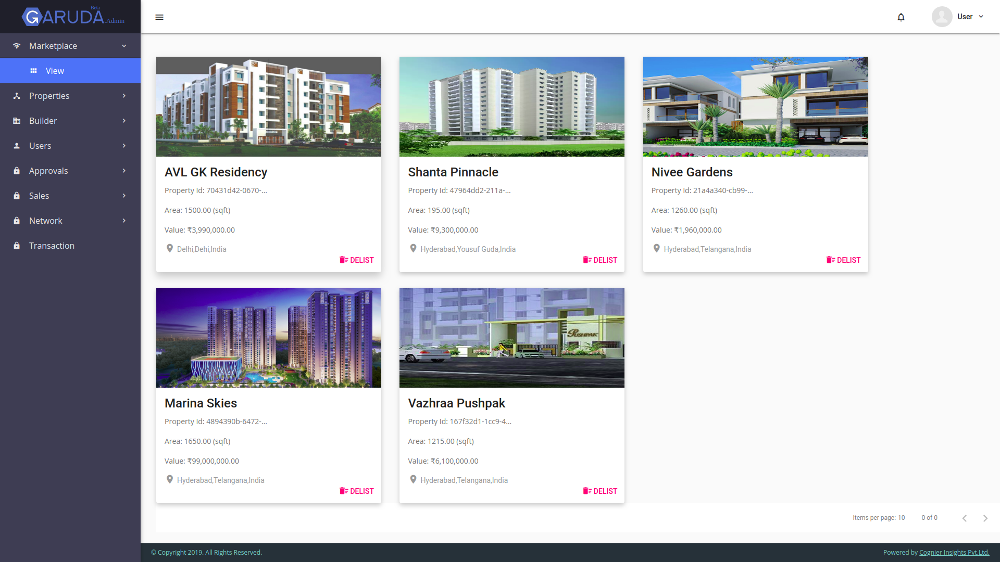  
 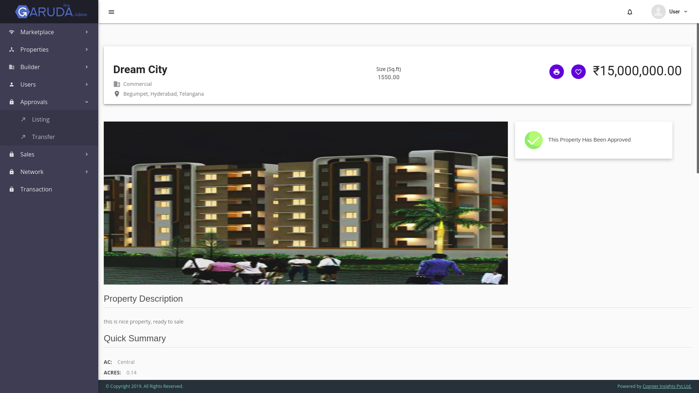                        
 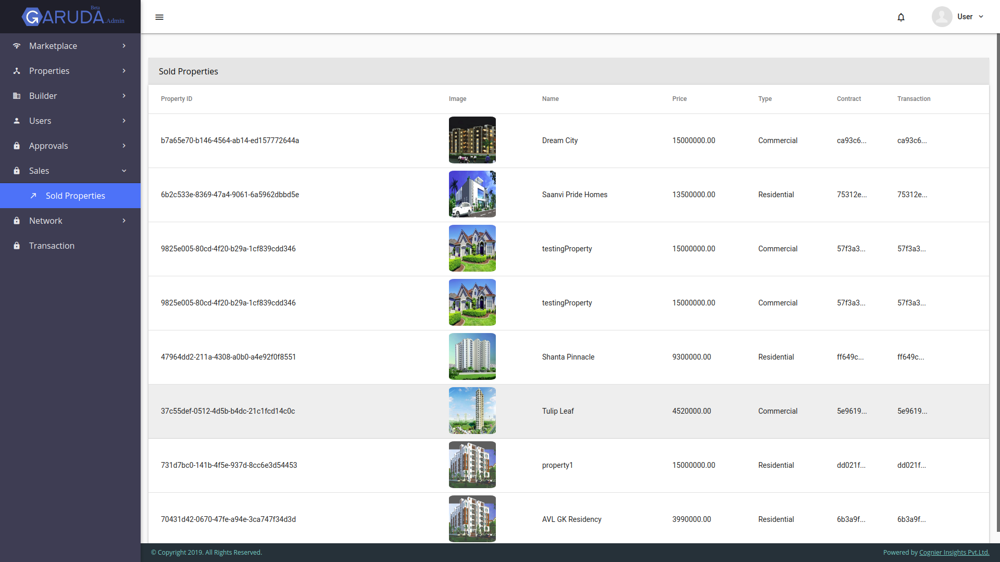 
 
 * Screenshots for **Government panel**  
 
 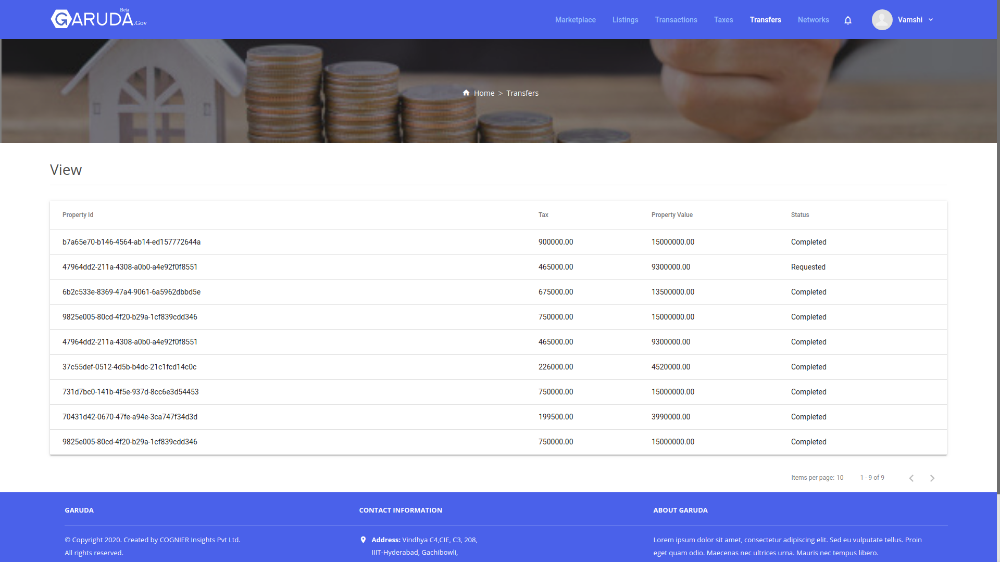  
 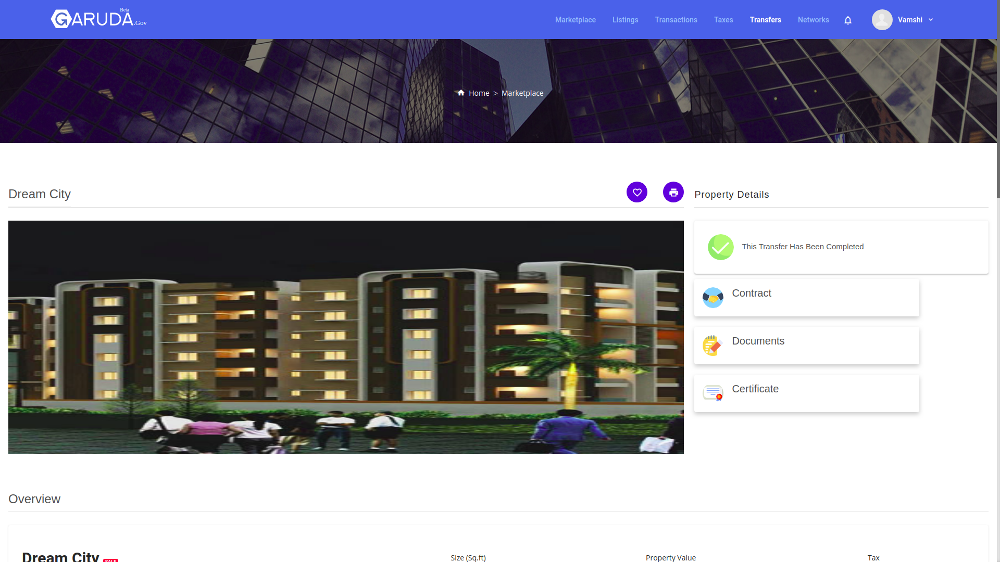                        
 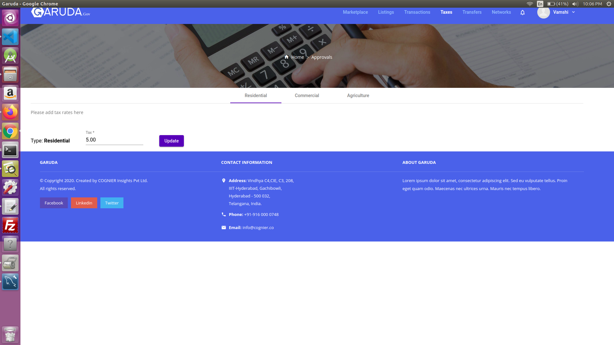 
 
 * Screenshots for **Users panel**  
 
 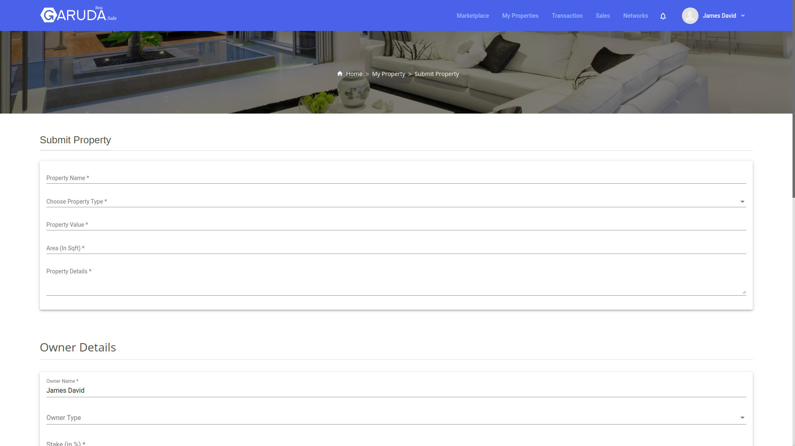  
 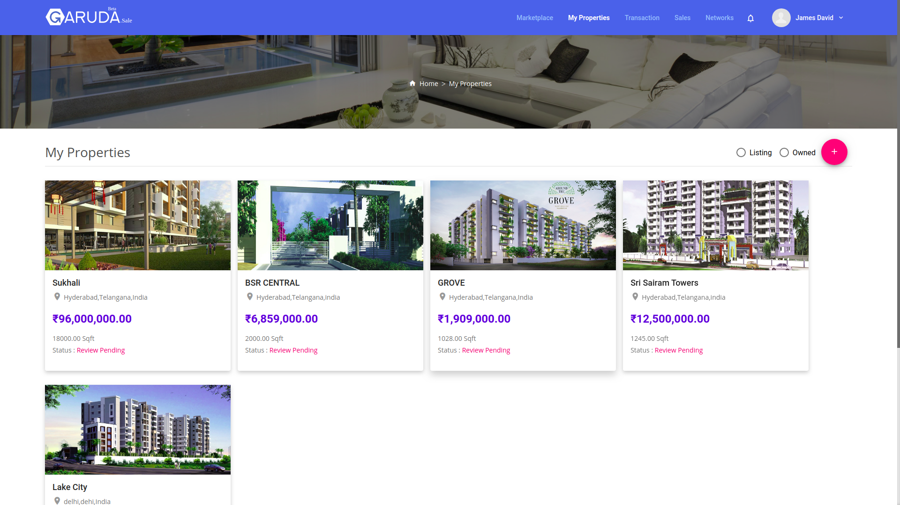                        
 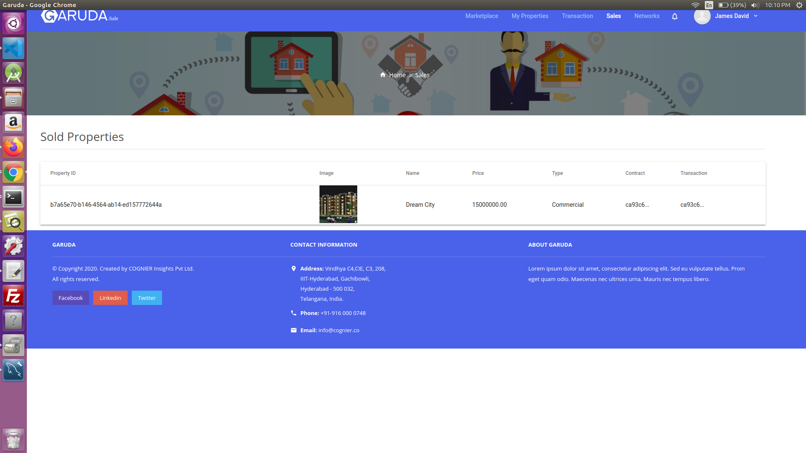 
 

## Authors

* **INFO SCIENCE LABS** - *Initial work* - [Info Science Lab](https://github.com/Infosciencelabs)

See also the list of [contributors](https://github.com/Infosciencelabsdev/Garuda/graphs/contributors) who participated in this project.
## Contact Us
  Email:- info@infoscience.co
## License
This project is licensed under the Apache License- see the [LICENSE.md](LICENSE.md) file for details

